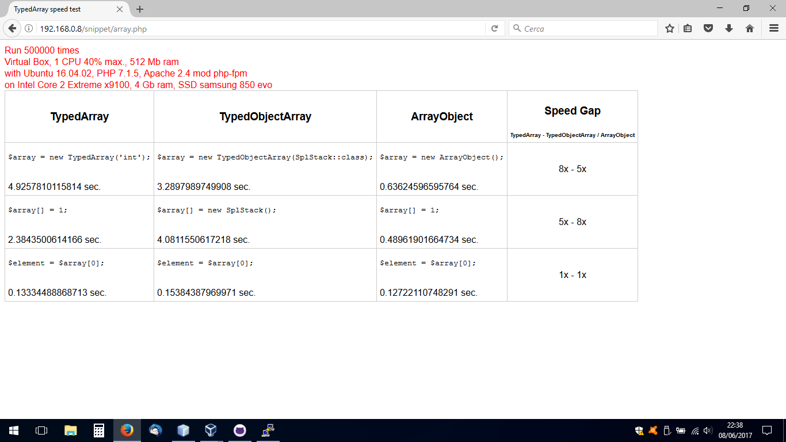

<br/>
<br/>
<br/>
[](https://travis-ci.org/linna/typed-array)
[](https://scrutinizer-ci.com/g/linna/typed-array/?branch=master)
[](https://scrutinizer-ci.com/g/linna/typed-array/?branch=master)
[](https://styleci.io/repos/93407083)

# Typed arrays for php
Provide typed arrays for php as extension of native [ArrayObject](http://php.net/manual/en/class.arrayobject.php).  

Package contain two classes:  
**TypedArray** for arrays that accept only values of the user defined type.  
**TypedObjectArray** for arrays that accept only class instances of the user defined type.

## Requirements
This package require php 7.

## Installation
With composer:
```
composer require linna/typed-array
```

## Usage - TypedArray
```php
use Linna\TypedArray;

//correct, only int passed to array.
$array = new TypedArray('int', [1, 2, 3, 4]);
$array[] = 5;

//throw InvalidArgumentException.
$array = new TypedArray('int', [1, 'a', 3, 4]);
//throw InvalidArgumentException.
$array[] = 'a';
```
Allowed types are: *array*, *bool*, *callable*, *float*, *int*, *object*, *string*.

## Usage - TypedObjectArray
```php
use Linna\TypedObjectArray;

//correct, only Foo class instances passed to array.
$array = new TypedObjectArray(Foo::class, [
    new Foo(),
    new Foo()
]);
$array[] = new Foo();

//throw InvalidArgumentException.
$array = new TypedObjectArray(Foo::class, [
    new Foo(),
    new Bar()
]);
//throw InvalidArgumentException.
$array[] = new Bar();
```
## Performance consideration
Compared to the parent class [ArrayObject](http://php.net/manual/en/class.arrayobject.php) typed arrays are slower on writing
approximately from 6x to 8x. The slowness is due to not native `__construct()` and not native `offsetSet()`.  
Other operations do not have a speed difference with the native ArrayObject.
```php
use Linna\TypedArray;

//slower from 6x to 8x.
$array = new TypedArray('int', [1, 2, 3, 4]);
$array[] = 5;

//other operations, fast as native.
//for example:
$arrayElement = $array[0];
$elements = $array->count();
```

View the speed test script on [gist](https://gist.github.com/s3b4stian/9441af5855b795cc1569b3cdb5e7526d).
